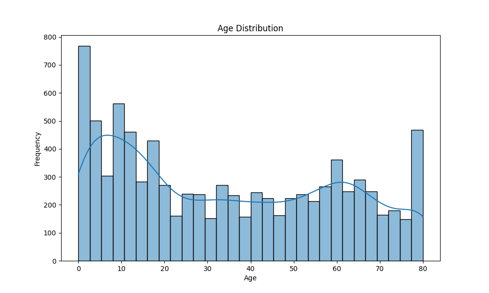
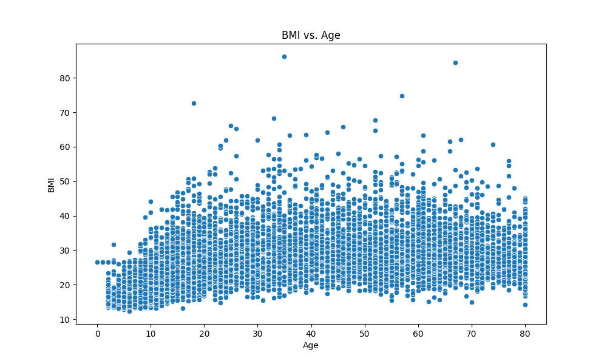

# NHANES Data Analysis Report

## Introduction

This report presents an analysis of the NHANES dataset focusing on demographics and body measurements. The goal is to explore health metrics and their relationships.

## Data Sources

- **Demographics Data**: Includes age, gender, and other demographic information.
- **Body Measurements Data**: Includes BMI and other physical measurements.

## Data Processing

The data was cleaned and processed using SQL and Pandas. Key steps included:
- Joining datasets on participant ID
- Handling missing values

## Visualizations

### Age Distribution

### BMI vs. Age

## Conclusion

The analysis provides insights into the distribution of age and its relationship with BMI. Further exploration could include other health metrics and demographic factors.
